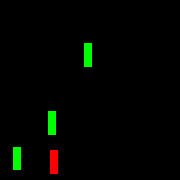
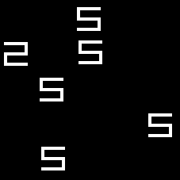
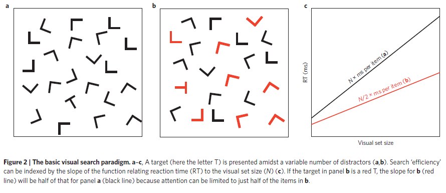

---
jupyter:
  jupytext:
    formats: ipynb,Rmd
    text_representation:
      extension: .Rmd
      format_name: rmarkdown
      format_version: '1.0'
      jupytext_version: 1.0.0
  kernelspec:
    display_name: Python 3
    language: python
    name: python3
---

# Convolutional Neural Networks Show Attention-like Effects When Performing Visual Search Tasks

## Introduction
Convolutional neural networks (CNNs) represent the state of the art in image recognition. Many mechanisms proposed to improve the performance on neural networks have been given the name "attention" [@xuShowAttendTell2015]. This may be surpising to scientists studying the visual system, who typically describe attention as a result of the limitated resources available for processing sensory inputs. These scientists have developed

## Convolutional neural networks as models of the visual system
Neural networks have in the past few years transitioned from being an academic area of artificial intellgience to being powerful tools for engineers working in areas such as image classification, speech-to-text, and automatic translation, to name but a few. In part because of this resurgence of research on neural networks, many in neuroscience and cognitive science have returned to using these models to understand the brain. Of course there are many questions about what aspects of the brain these models actually capture [@cichyDeepNeuralNetworks2019] and there are many suggestions on how to make their behavior closer to our own [@lakeBuildingMachinesThat2017; @marcusDeepLearningCritical2018]. 
In the 1980s, artificial neural networks trained with backpropagation gave rise to [Connectionist](https://en.wikipedia.org/wiki/Connectionism) models of cognition. Similar neural network models lie at the heart of the recent rise of deep learning, in large part because of advances in methods for training algorithms, and advances in technology such as GPUs that allow for parallelized training. When benchmarked with scalar metrics like accuracy on computer vision tasks such as object recognition, these deep neural networks appear capable of human or super-human levels of skill. The first major gains in accuracy were seen on image classification tasks such as ImageNet <cite data-cite="6027200/WGZWMWX7"></cite>, and the deep neural networks that made these advances were built with what are known as convolutional layers. As the name implies, these layers perform a convolution-like operation by multiplying filters of learned weights with the input image, producing as outputs feature maps that can be further transformed by succeeding layers.

Many researchers have drawn parallels between the architecture of convolutional neural networks (CNNs) and the architecture of the visual system in the brain <cite data-cite="6027200/8ISULWGF"></cite>, in particular in humans and other primates where this system has been most thoroughly studied. Like CNNs, the visual system has a hierarchical structure, and is thought to function in part by performing transformations at each level of this hierarchy so that high-dimensional, low-level features are mapped into low-dimensional abstract representations. Several recent studies in the realm of cognitive neuroscience have measured representations in more directly tested the similarities between CNNs and the visual system, by comparing representations in both <cite data-cite="6027200/6D4LKJD9"></cite><cite data-cite="6027200/U77Y74SI"></cite>. Representations can be easily extracted from CNNs because they are "transparent box" models--i.e. we have access to the "activity" of the individual units from which these models are built when we "show" the CNNs a stimulus. In the same studies, brain activity was obtained with electrophysiological or functional imaging methods. Such studies have found in general that representations are similar. (The comparison depends on representational similarity methods <cite data-cite="6027200/IQ2Y895S"></cite><cite data-cite="6027200/EQTU2P3Z"></cite>, but the concern of this study is not the validity of those methods.)


### Does learning to perform some task with high accuracy constrain neural networks and brains to learn similar representations?
The authors conclude that one factor that may cause this representational similarity is that the goal-driven tasks provide a constraint on learning. In other words, these hierarchichal architectures learn similar representations because those representations provide a way to succesfully carry out behavior. Similar claims have been made elsewhere, e.g. that the brain and artificial networks both learn similar representations of location when performing navigation tasks <cite data-cite="6027200/LHVT6V6M"></cite><cite data-cite="6027200/SAZAIFBG"></cite>. 

The impressive accuracy of deep convolutional neural networks performing image recognition tasks, taken in combination with the apparent correlations between their activity and activity in the primate visual system, raises two questions: (1) how accurately do CNNs perform other tasks that are though to rely on the visual system, and (2) if they perform a task accurately, is that enough evidence to conclude that they provide useful models of the visual system?


### Another type of constraint: controlled behavioral tasks in the lab
Importantly, the researchers in the studies just described constrain the "task"--passively viewing images--when measuring brain activity, with the goal of being able to directly compare brain activity to activity in neural networks. Specifically, the subjects are only shown the visual stimuli very briefly, typically about 100 ms for monkey electophysiology experiments and 300 ms for human neuroimaging experiments. There are a couple of reasons for this. The first is to allow for an apples-to-apples comparison between the brain and CNNs. Although the brain is highly recurrent, CNNs are purely **feedforward**. The researchers want to claim that they have only elicited  initial feedforward activity in the visual system by just briefly showing subjects the stimuli, without allowing feedback to influence activity, and by extension, the representation.
The second reason for the constraint of showing images only briefly is more historical. Classically, the visual system has been studied with what has been termed **passive vision** approach <cite data-cite="6027200/B49GIRUD"></cite>. This approach could be characterized as conceiving of the eye as unmoving, with a still image falling upon it that is then processed in parallel across the scene to extract information. These types of models have obviously been successful, and the incredible accuracy of CNNs might even be described as the culmination of this approach. The point here is not to debate about issues with passive vision models; most readers probably take it for granted that humans move their eyes, and anyone who has tried to walk through a crowd while texting on their phone will know that there are limitations on our ability to process the entire visual scene in parallel.

### Visual search tasks for investigating attention
The same constraint that was used to make apples-to-apples comparisons between CNNs and the brains, briefly showing stimuli, has also been used in visual search tasks in the laboratory <cite data-cite="6027200/AEJJ5749"></cite>, in part because of the passive vision approach with which the visual system has typically been studied. The fact that the same constraint was applied to visual search tasks lets us use the same logic as studies which conclude that goal-driven tasks constrain learning to produce useful representations. We can take advantage of this shared constraint to invert the logic and state a new hypothesis: if a CNN has learned the same representation as the brain, then its behavior when performing tasks should match our behavior. In other words, we are asking whether we can extend a claim about CNNs, that they provide good models of the visual system, by examining how they behave when performing a visual search task. There are several objections that could be made to doing so, including the question of whether the task we'll look at is really any different from image recognition. But let's pretend for a moment that the question is worth asking. Why is it worth doing so? To consider more generally how much we can learn about cognition by measuring the behavior of our model with a scalar metric applied to a highly constrained task.

What is that task? In the "classical" form of the visual search paradigm <cite data-cite="6027200/AEJJ5749"></cite>, experimenters present a stimulus to a subject made up of discrete items, i.e. objects. The subject is asked to report whether a target is present among distractors-- the experimenter sets the probability that the target will be present on any given trial. Experimenters measure the reaction time and/or accuracy of the subjects. Often, the results are presented as a plot of reaction time as a function of set size (the number of discrete items in stimulus). By fitting a line to the plot of reaction times as a function of set size and taking the slope of that line, experimenters produced estimates of processing speed, i.e. "seconds per item". Slopes are almost horizontal when subjects are shown visual search stimuli where targets differ from distractors in some clearly salient feature, e.g. a red target among green distractors, and slopes become much steeper when targets differ from distractors in some harder-to-distinguish conjunction of features, e.g., a digital 2 among digital 5s. Some examples of these stimuli are shown below, generated with https://github.com/NickleDave/searchstims.

<table><tr>
<td>  </td>
<td>  </td>
</tr>
<tr>
<td> <b>Feature</b> search $\longrightarrow$ almost horizontal slopes </td>
<td> <b>Spatial configuration</b> search $\longrightarrow$ steep slopes </td>
</tr>
</table>

Below is a figure explaining the basic visual search paradigm, reproduced from [Wolfe Horowitz 2017](http://search.bwh.harvard.edu/new/pubs/FiveFactors_Wolfe-Horowitz_2017.pdf)



This use of search slope as metric led to one of the most influential early models of visual search: feature integration theory <cite data-cite="6027200/KYF4NSZP"></cite>. Essentially, feature integration theory posits that the brain can search the visual field in parallel when a single feature distinguishes the target from distractors, but that a conjunction of multiple features requires serial processing. However, Wolfe <cite data-cite="6027200/LJEPEDWB"></cite>(1998) showed that there is no clear cut segregation of slopes into one type or the other, and that in fact the distributions of slope overlap so much it is not possible to distinguish them. He has proposed talking about visual search in terms of a spectrum of of speeds that depend in some way on features: when a salient feature like color is what discriminates the target from the distractor, this allows for **efficient** search, like in the visual search stimulus on the left. When a complex conjunction of features distinguishes the target from the distractor, as in the visual search stimulus on the right, this results in **inefficient** search.


### Accuracy as a measure of attentional effects
Although these classic visual search tasks were originally designed to answer questions about how features were processed across the visual field, they went on to became the basis for most modern theories of selective visual attention. As described above, the feature integration theory (FIT) held that some features could be processed in parallel, in a pre-attentional way, but a conjunction of features required directing attention to it, and that items consisting of such features were processed in a serial way. Given this theory about the algorithms underlying attention, reaction times become a proxy for attention; they are what we measure to see if our theories about attention are correct.  
The approach of measuring reaction times is not always used. In some cases, the stimulus is shown only briefly to the subject, and then after a variable length of time a masking stimulus such as white noise is shown. During the period between the stimulus with a set of items and the masking stimulus, the "*internal representation* of that stimulus can be searched \[by the subject\] until a mask appears several hundred milliseconds later" <cite data-cite="6027200/AEJJ5749"></cite> (emphasis added). When accuracy is measured as a function of set size, they have an inverse linear relationship, instead of the linear relationship seen between reaction times and set size. When the task is changed as just described, and accuracy is used as the measure, it fulfills the same function as reaction times: we use accuracy to tell us whether attentional processes behaves as we think it does. **But of course CNNs have no built-in mechanism of attention; in effect, they process the entire visual field in parallel, in a single pass, instantaneously**. Therefore, if we see attention-like effects when measuring the accuracy of CNNs, we must either conclude either one of two things: (1) we have not chosen a task and/or metric that gives us insight into the processing going on. Maybe a single scalar metric like accuracy is not actually telling us much about the behavior used to achieve the task, or the internal process of the algorithm that is performing the task. Or (2) we have chosen a good task and/or metric, but there's some other explanation that doesn't require attention, because an algorithm without attention can produce the same behavior that we produce. Maybe attention-like effects are just what happens when brains and CNNs solve this task, because targets are hard to discriminate from distractors, regardless of the features.


## Results
In an initial set of simulations, we trained a CNN to "perform" the visual search task. We used the AlexNet architecture, which has previously been used in studies comparing CNNs to the visual system <cite data-cite="6027200/U77Y74SI"></cite><cite data-cite="6027200/ZT5GRNIN"></cite>. To train AlexNet, we followed a fine-tuning approach, where we re-used weights from training this CNN on the ImageNet dataset. During fine-tuning, the weights in the convolutional layers were frozen, but randomly initialized weights in the final fully-connected layers were update with a very small learning rate. The original softmax layer with 1000 outputs representing ImageNet classes was replaced with a 2-unit softmax layer, where one unit represented a response of "target present" and the other a response of "target absent". This approach is similar to that taken by a previous study <cite data-cite="6027200/9CAW6DFJ"></cite>; we discuss differences in the details of fine-tuning in the methods below. To generate visual search stimuli that could be fed into a neural network, we used a simple Python package (<https://github.com/NickleDave/searchstims>) built on top of the [PyGame](https://www.pygame.org) library . The search displays were divided up into a 5x5 grid of cells, and items were plotted in a randomly chosen subset of cells (as described in <cite data-cite="6027200/QCQFYFDZ"></cite> and shown at <http://search.bwh.harvard.edu/new/data_set_files.html>). The library applied jitter to the items, so that two images could be different even if both images had the same set size and target present condition, and the items were in the exact same cells.  This is typically done with visual search stimuli used in psychophysics experiments, but an added benefit was that this allowed us to create a large set of unique training images (on the order of ten thousand) for each set size and condition, in effect resulting in a sort of data augmentation, as is often used when training neural networks.

### AlexNet shows attentional effects without any attention mechanisms in spite of processing images in parallel
After training AlexNet to perform this task, we found to our surprise that the results qualitatively resemble those seen for human subjects. We plotted accuracy as a function of set size, and saw that slopes of these lines were close to horizontal when AlexNet performed the task given feature search stimuli, where the target was a red vertical rectangle among distractors that were green vertical rectangles. In contrast, the slopes were steep when AlexNet performed the task given spatial conjunction search stimuli, where the target was a digital 2 and the distractors were digital 5s.

```{python}
# %matplotlib inline
import os

from searchnets.plots.figures import ftr_v_spt_conj, mn_slope_by_epoch

TEST_RESULTS_DIR = '../../data/experiment_1/results'
eff_400_results = os.path.join(TEST_RESULTS_DIR,
                            'config_efficient_400_epochs_models/test_alexnet_output.gz')
ineff_400_results = os.path.join(TEST_RESULTS_DIR,
                             'config_inefficient_400_epochs_models/test_alexnet_output.gz')

ftr_v_spt_conj(eff_400_results,
               ineff_400_results,
               epochs=400)
```

**Figure 1. Accuracy of AlexNet when reporting whether a target is present or absent, given efficient or inefficent visual search stimuli** X axis is set size, i.e., number of items in the visual search stimulus shown to the network. Y axis is mean accuracy for each set size, as measured on a previously unseen test set. The test set contained ~3000 images, balanced so that there were equal numbers of images for each set size.  Each line represents one trained network; there are five replicates total.


### Higher accuracy correlates with stronger attentional effects
Given the surprising result that CNNs showed attention-like effects without attention mechanisms and in spite of processing their inputs in a parallel, feedforward fashion, we next asked whether these effects might depend on training. Again to our surprise, we saw that slopes for the feature search got closer to zero as we increased the number of epochs of training, while the slopes for spatial conjunction search got steeper. This was in spite of the fact that training accuracy continued to increase up until about 800 epochs, as measured on a validation set. 

```{python}
TEST_RESULTS_DIR = '../../data/experiment_2/results'
epochs_list = [10, 50, 200, 800]
eff_results_list = []
ineff_results_list = []
for epochs in epochs_list:
    eff_results = os.path.join(TEST_RESULTS_DIR, f'config_efficient_{epochs}_epochs_models/test_alexnet_output.gz')
    eff_results_list.append(eff_results)
    ineff_results = os.path.join(TEST_RESULTS_DIR, f'config_inefficient_{epochs}_epochs_models/test_alexnet_output.gz')
    ineff_results_list.append(ineff_results)
    ftr_v_spt_conj(eff_results,
                   ineff_results,
                   epochs=epochs)
```

To quantify this result, we fit slopes to the accuracy vs. set size plots for each trained replicate of AlexNet, for each number of training epochs. As shown below, the slope for feature search decreased as the number of training epochs increased, while the slpe for spatial conjunction search increased. We took the mean slope for each type of search stimulus and subtracted them to get a measure of the difference, and saw that indeed this difference did increase as the number of training epochs increased.

```{python}
mn_slope_by_epoch(eff_results_list, ineff_results_list, epochs_list)
```

## Methods
Alexnet training:
• based on Poder 2017
https://arxiv.org/pdf/1707.09775.pdf
• Stochastic gradient descent
• Learning rate for fully-connected layers: 1e-20
• 10 epochs (as in Poder 2017), and 400 epochs


## References
<div class="cite2c-biblio"></div>
